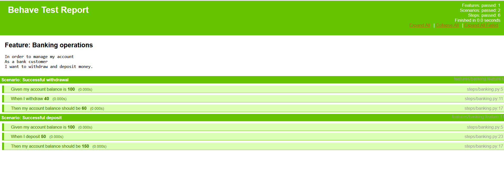
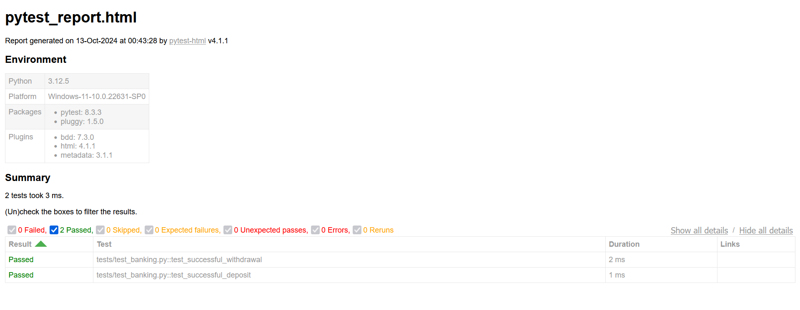

### Behave BDD Automation 
#### Objective - 
The Following Repository contains basic scripts to understand behavior driven testing using **Behave** Python Module.

#### Modules Used - 
1. Behave (Python alternative of cucumber)
2. pytest (testing module for python)
3. pytest-html (HTML Reporting Tool)
4. selenium (for web automation)
5. playwright (for web automation)

#### Running Pytest testcases - 
```
pytest
```

### Running Behave Test suite - 
```
behave
```

### Creating HTML Reports using Behave - 
```
 behave -f html -o reports/behave-report.html
```

### Behave HTML Report Preview -


### Pytest HTML Report Preview - 
